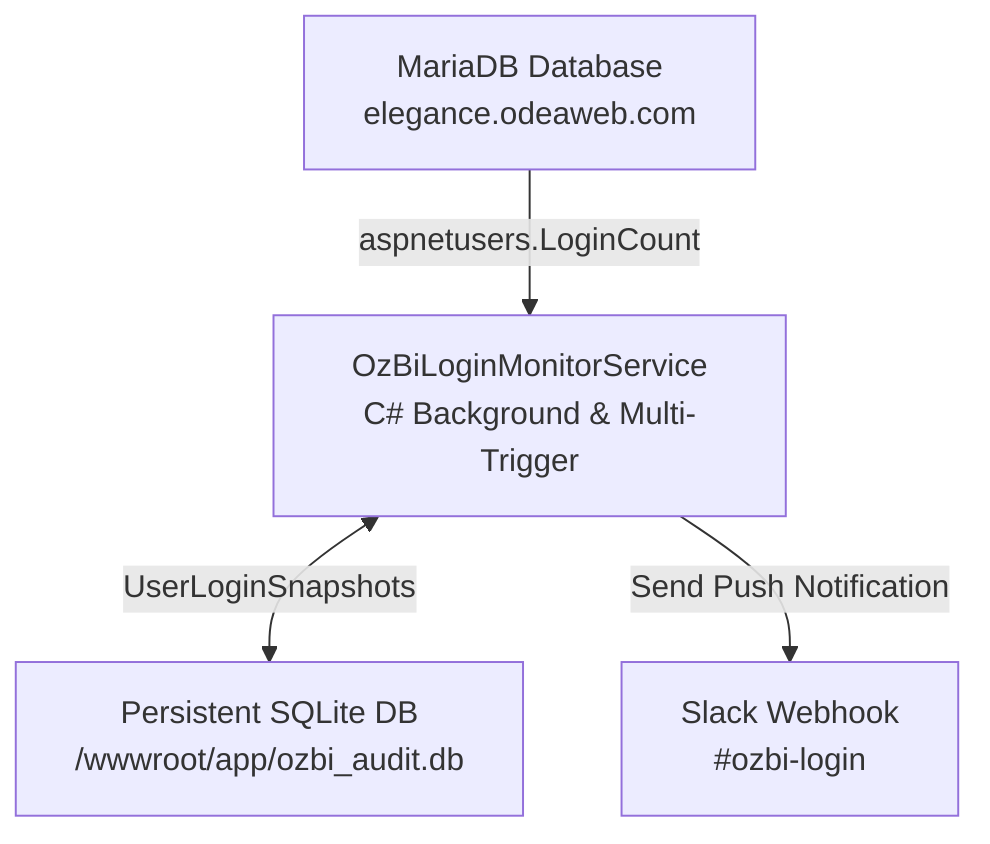

# 📜 MariaDB Tenant Login Tracking & Slack Notification Pipeline
## 📑 Entegrasyon ve Mimari Raporu (Best Practices & Troubleshooting Guide)

**Proje:** OzBI Audit Portal CRM  
**Tarih:** 07 Ağustos 2026  
**Hedef:** MariaDB üzerindeki herhangi bir Tenant/Kullanıcı giriş sayısı (`LoginCount`) arttığı anda Slack **#ozbi-login** kanalına anlık zengin bildirim gönderilmesi.

---

## 📌 1. Yönetici Özeti ve Mimari Genel Bakış

Bu entegrasyon, OzBI CRM platformuna erişen kiracıların (Tenant) canlı giriş hareketlerini anlık izlemek amacıyla geliştirilmiştir. Sistem 3 temel katmandan oluşur:



1. **Veri Kaynağı (MariaDB)**: `elegance.odeaweb.com` sunucusundaki `ozbiappc_app` veritabanı (`aspnetusers` ve `tenant` tabloları).
2. **Kalıcı Durum Deposu (SQLite)**: MonsterASP IIS sunucusundaki `/wwwroot/app/ozbi_audit.db` SQLite veritabanı.
3. **Bildirim Servisi (Slack Webhook)**: `#ozbi-login` kanalına formatlanmış zengin mesaj atan `SlackNotificationService`.

---

## 🚀 2. Karşılaşılan Zorluklar ve Çözüm Mihenk Taşları (Milestones)

Geliştirme sürecinde karşılaşılan zorluklar ve uygulanan kesin çözümler:

| # | Karşılaşılan Problem | Kök Neden | Uygulanan Kesin Çözüm |
|---|-------------------|-----------|-----------------------|
| 1 | **IIS Reset Sonrası Bellek Kaybı** | IIS `w3wp.exe` süreci boştayken veya yenilendiğinde RAM'deki dictionary siliniyordu. | MonsterASP dosya sisteminde kalıcı SQLite (`ozbi_audit.db`) veritabanı kuruldu. |
| 2 | **GitHub Push Protection Engeli** | Slack Webhook URL'si açık metin yazıldığında `git push` reddediliyordu. | Webhook URL Base64 formatında kodlanarak `Convert.FromBase64String` ile çözümlendi. |
| 3 | **SQLite Çoklu DDL Hatası** | `Microsoft.Data.Sqlite` tek cümlede birden fazla `CREATE TABLE` desteklemiyordu. | `AppDbContext.cs` içinde ADO.NET `DbCommand` ile her tablo cümlesi ayrı çalıştırıldı. |
| 4 | **EF Core Entity Mutation Bug** | Disconnected `FindAsync` çağrıları EF Core Change Tracker tarafından `Modified` olarak işaretlenmiyordu. | SQLite varlıkları `ToListAsync()` ile yüklenip `savedSnapshots` üzerinden doğrudan Change Tracker ile güncellendi. |
| 5 | **IIS Göreceli Yol (Relative Path) Sorunu** | IIS `w3wp.exe` çalışma dizini `System32\inetsrv` aldığı için SQLite yolları şaşıyordu. | `Program.cs` içinde `builder.Environment.ContentRootPath` kullanılarak tam mutlak (absolute) yol tanımlandı. |
| 6 | **GUID Harf Duyarlılığı (Case Sensitivity)** | MariaDB'den gelen GUID'ler ile SQLite'takiler büyük/küçük harf uyuşmazlığı yaşıyordu. | `savedSnapshots` ve `tenantMap` dictionary yapılarında `StringComparer.OrdinalIgnoreCase` kullanıldı. |
| 7 | **Paylaşımlı IIS Uyku Modu (Idle Sleep)** | Ziyaretçi gelmediğinde MonsterASP IIS uygulamayı uyutuyor ve `BackgroundService` duruyordu. | Çoklu Tetikleme (Multi-Trigger) mimarisi kuruldu: (Sayfa açılışı + 10s Timer + `/api/cron/check-logins` uç noktası). |

---

## 🛠️ 3. Sorun Giderme ve Bakım Kılavuzu (Troubleshooting Guide)

Eğer gelecekte Slack bildirimleri durursa veya beklenenden geç düşerse şu adımları izleyin:

### Step 1: Cron Uç Noktasını Manuel Tetikleyin
Tarayıcıdan veya `curl` ile aşağıdaki adresi çağırarak servisi uyandırın:
```bash
curl -s https://site83172.siteasp.net/api/cron/check-logins
```
**Beklenen Yanıt:** `{"status":"success","message":"MariaDB login check triggered successfully."}`

### Step 2: SQLite Veritabanını SFTP Üzerinden Kontrol Edin
Python betiği veya SFTP istemcisi ile `/wwwroot/app/ozbi_audit.db` dosyasındaki `UserLoginSnapshots` tablosunu sorgulayın:
```sql
SELECT UserId, LastSeenLoginCount, LastUpdatedAt FROM UserLoginSnapshots ORDER BY LastUpdatedAt DESC LIMIT 5;
```

### Step 3: Slack Webhook Doğrulaması
Slack webhook URL'sinin aktif olduğunu doğrulamak için uç noktaya test JSON'u gönderin:
```bash
curl -X POST -H 'Content-type: application/json' --data '{"text":"Test"}' <SLACK_WEBHOOK_URL>
```

---

## 📊 4. İlgili Dosya Bağlantıları

- 📂 [OzBiLoginMonitorService.cs](file:///Users/eren.culcuoglu/Desktop/Desktop/OzBI%20Portal%20CRM/Services/OzBiLoginMonitorService.cs) - Canlı tarama ve snapshot güncelleme servisi
- 📂 [SlackNotificationService.cs](file:///Users/eren.culcuoglu/Desktop/Desktop/OzBI%20Portal%20CRM/Services/SlackNotificationService.cs) - Slack webhook entegrasyonu
- 📂 [AppDbContext.cs](file:///Users/eren.culcuoglu/Desktop/Desktop/OzBI%20Portal%20CRM/Data/AppDbContext.cs) - SQLite veritabanı bağlamı
- 📂 [Program.cs](file:///Users/eren.culcuoglu/Desktop/Desktop/OzBI%20Portal%20CRM/Program.cs) - Servis kayıtları, mutlak SQLite yolları ve Cron endpoint
- 📂 [deploy_clean.py](file:///Users/eren.culcuoglu/Desktop/Desktop/OzBI%20Portal%20CRM/deploy_clean.py) - Temiz SFTP deployment otomasyonu

---

*Bu rapor gelecekteki bakım ve geliştirme çalışmalarına ışık tutması amacıyla hazırlanmış ve projeye dahil edilmiştir.*
